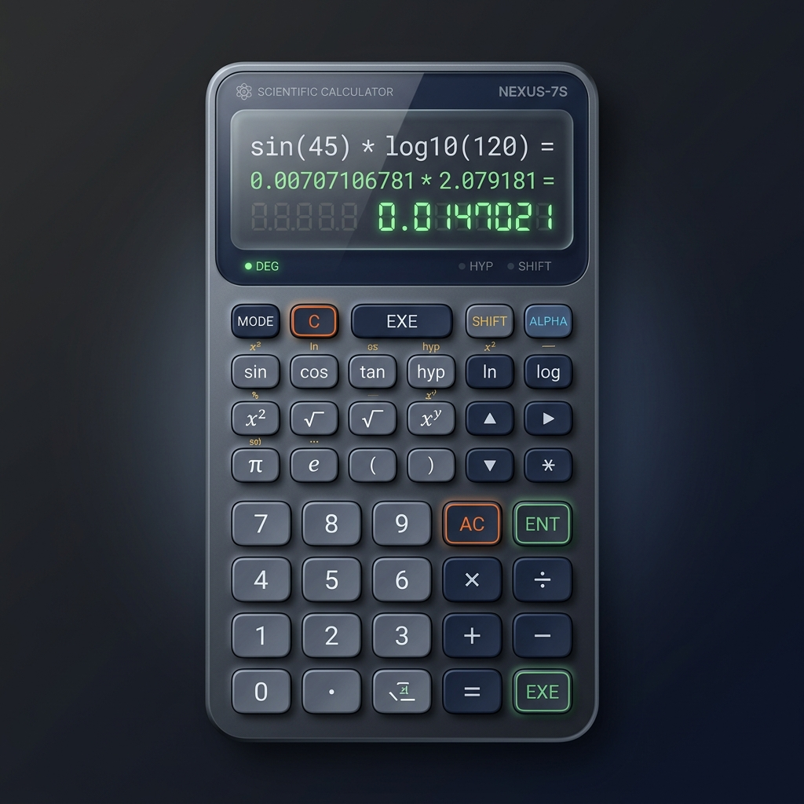

# 🧮 3D Scientific Calculator - Daily UI 004

A high-fidelity, scientific calculator designed as part of the **Daily UI Challenge**. This project explores the intersection of **3D aesthetics**, **Glassmorphism**, and **Neumorphic** design principles to create a tactile and premium user experience.

## ✨ Key Features
- **3D Neumorphic Pad**: Buttons feature multi-layered shadows and gradients to simulate physical elevation and tactile depth.
- **Glassmorphic Display**: A semi-transparent display area utilizing backdrop-blur filters and subtle glass highlights for a modern look.
- **Scientific Logic**: Fully functional computation for core scientific operations including Trigonometry (sin, cos, tan), Square Roots, and Constants (π).
- **Responsive Layout**: Fluid grid system built with Bootstrap 5, ensuring the calculator looks stunning on desktop and mobile devices.
- **Dynamic Interaction**: Active press states and hover effects that provide immediate visual feedback to the user.

## 🛠️ Built With
- **HTML5**: Semantic structure and modern markup.
- **Vanilla CSS**: Advanced CSS3 techniques including `backdrop-filter`, `linear-gradients`, and complex `box-shadow` stacking.
- **JavaScript**: Core logic for scientific calculations and UI updates.
- **Bootstrap 5**: Grid system and responsive utility classes.
- **Font Awesome 6**: Premium iconography for function keys.

---
*Created as part of the Daily UI 100 Days Challenge.*
